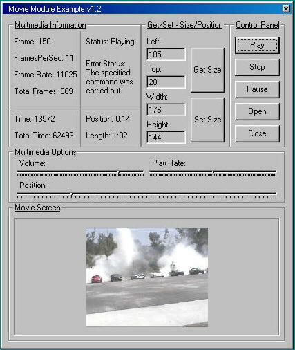



## Movie Module v1\.2\.6 \*Updated\*

### Description

Easily create a movie player using the already established mci api. No need for 3rd pary .ocx or .dll controls. This module contains almost 70 functions ranging from setting the play rate to shutting down video output. Plays a wide range of movie files including, avi, mpeg, mpeg2, quicktime, divx(must have divx codec installed), you could even modify it to play dvd's if your video card has dvd playback capabilities. You can easily learn how to program the mci device with this module. I included a basic example on how to use it. Please vote and leave feedback so I know whether or not to continue improving the code.
 
### More Info
 

             |
---                |---
**Submitted On**   |2002-03-13 14:38:52
**By**             |[Jason Hensley](https://github.com/Planet-Source-Code/PSCIndex/blob/master/ByAuthor/jason-hensley.md)
**Level**          |Beginner
**User Rating**    |4.6 (37 globes from 8 users)
**Compatibility**  |VB 4\.0 \(32\-bit\), VB 5\.0, VB 6\.0
**Category**       |[Sound/MP3](https://github.com/Planet-Source-Code/PSCIndex/blob/master/ByCategory/sound-mp3__1-45.md)
**World**          |[Visual Basic](https://github.com/Planet-Source-Code/PSCIndex/blob/master/ByWorld/visual-basic.md)
**Archive File**   |[Movie\_Modu618883132002\.zip](https://github.com/Planet-Source-Code/jason-hensley-movie-module-v1-2-6-updated__1-32633/archive/master.zip)

